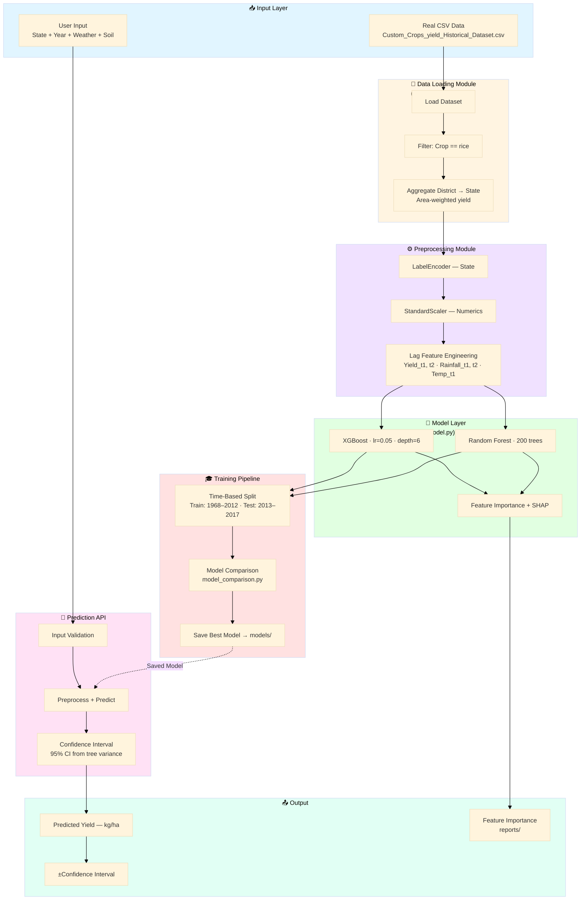

# India Paddy Yield Prediction

**State-Wise Paddy Yield Forecasting Using Real Climatic, Soil, and Historical Features**

A production-ready, research-grade machine learning pipeline for predicting rice yield across 20 Indian states. All features are real measured data — no synthetic generation.

---

## Overview

| Property | Detail |
|----------|--------|
| **Crop** | Rice / Paddy |
| **Region** | India — 20 States |
| **Dataset** | Custom Crops Yield Historical Dataset (1966–2017) |
| **Granularity** | State-Year |
| **Best Model** | Random Forest Regressor |
| **R²** | **0.9438** |
| **RMSE** | **174.97 kg/ha** |
| **Split Strategy** | Time-based (Train: 1968–2012 · Test: 2013–2017) |

---

## Features

✅ **Real soil data** — N, P, K, pH (no synthetic generation)  
✅ **Real weather data** — Temperature, Rainfall, Humidity, Wind Speed, Solar Radiation  
✅ **Time-aware modelling** — Lag features (Yield_t1, Yield_t2, Rainfall_t1, Rainfall_t2, Temp_t1)  
✅ **No data leakage** — Strict time-based train/test split  
✅ **Model comparison** — Random Forest vs XGBoost  
✅ **Research notebook** — 12-section academic Jupyter notebook included  

---

## Model Architecture


```mermaid
%%{init: {'theme':'base', 'themeVariables': { 'fontSize':'14px'}}}%%
flowchart TD
    subgraph Input["📥 Input Layer"]
        A1[Real CSV Data<br/>Custom_Crops_yield_Historical_Dataset.csv]
        A2[User Input<br/>State + Year + Weather + Soil]
    end

    subgraph DataLoader["🔄 Data Loading Module<br/>(data_loader.py)"]
        B1[Load Dataset]
        B2[Filter: Crop == rice]
        B3[Aggregate District → State<br/>Area-weighted yield]
    end

    subgraph Preprocessing["⚙️ Preprocessing Module<br/>(preprocessing.py)"]
        C1[LabelEncoder — State]
        C2[StandardScaler — Numerics]
        C3[Lag Feature Engineering<br/>Yield_t1, t2 · Rainfall_t1, t2 · Temp_t1]
    end

    subgraph Model["🤖 Model Layer<br/>(model.py)"]
        D1[Random Forest · 200 trees]
        D2[XGBoost · lr=0.05 · depth=6]
        D3[Feature Importance + SHAP]
    end

    subgraph Training["🎓 Training Pipeline<br/>(train.py)"]
        E1[Time-Based Split<br/>Train: 1968–2012 · Test: 2013–2017]
        E2[Model Comparison<br/>model_comparison.py]
        E3[Save Best Model → models/]
    end

    subgraph Prediction["🔮 Prediction API<br/>(predict.py)"]
        F1[Input Validation]
        F2[Preprocess + Predict]
        F3[Confidence Interval<br/>95% CI from tree variance]
    end

    subgraph Output["📤 Output"]
        G1[Predicted Yield — kg/ha]
        G2[±Confidence Interval]
        G3[Feature Importance<br/>reports/]
    end

    A1 --> B1 --> B2 --> B3 --> C1 --> C2 --> C3 --> D1
    C3 --> D2
    D1 --> D3
    D2 --> D3
    D1 --> E1 --> E2 --> E3
    D2 --> E1
    E3 -.Saved Model.-> F2
    A2 --> F1 --> F2 --> F3 --> G1 --> G2
    D3 --> G3

    style Input fill:#e1f5ff
    style DataLoader fill:#fff4e1
    style Preprocessing fill:#f0e1ff
    style Model fill:#e1ffe1
    style Training fill:#ffe1e1
    style Prediction fill:#ffe1f5
    style Output fill:#e1fff4
```

---

## Model Comparison

| Model | RMSE (kg/ha) | MAE (kg/ha) | R² | MAPE (%) |
|-------|:---:|:---:|:---:|:---:|
| **Random Forest** ✅ | **174.97** | 128.38 | **0.9438** | 5.35 |
| XGBoost | 182.33 | **124.88** | 0.9390 | **5.05** |

> **Best model: Random Forest** — higher R² and lower RMSE on the unseen 2013–2017 test set.  
> Both models trained with time-based split only — no random shuffling, no data leakage.

---

## Feature Set (Real Data Only)

| Feature | Type | Source |
|---------|------|--------|
| `State` | Categorical | Dataset |
| `Year` | Numeric | Dataset |
| `Rainfall_mm` | Real | Dataset |
| `Temperature_C` | Real | Dataset |
| `Humidity_%` | Real | Dataset |
| `N_req_kg_per_ha` | Real ✅ | Dataset (replaces synthetic) |
| `P_req_kg_per_ha` | Real ✅ | Dataset (replaces synthetic) |
| `K_req_kg_per_ha` | Real ✅ | Dataset (replaces synthetic) |
| `pH` | Real ✅ | Dataset (replaces synthetic) |
| `Wind_Speed_m_s` | Real | Dataset |
| `Solar_Radiation_MJ_m2_day` | Real | Dataset |
| `Yield_t1` | Lag | Engineered |
| `Yield_t2` | Lag | Engineered |
| `Rainfall_t1` | Lag | Engineered |
| `Rainfall_t2` | Lag | Engineered |
| `Temp_t1` | Lag | Engineered |

**Target:** `Yield_kg_per_ha`

---

## Project Structure

```
crop_yield_prediction/
├── src/
│   ├── config.py              # Paths, features, model params
│   ├── data_loader.py         # Load, filter, aggregate, lag features
│   ├── preprocessing.py       # Encode + scale
│   ├── model.py               # RF + XGBoost wrapper
│   ├── model_comparison.py    # Time-split + comparison table
│   ├── train.py               # Full training pipeline
│   ├── reporting.py           # Feature importance, plots, SHAP
│   └── predict.py             # Prediction API
├── data/
│   └── india_paddy_clean.csv  # 995 rows · 20 states · 1968–2017
├── models/
│   ├── yield_model.pkl        # Trained RF model (via Git LFS)
│   └── preprocessor.pkl       # Fitted encoders + scaler
├── reports/
│   ├── feature_importance.png
│   ├── predictions_vs_actual.png
│   └── residuals.png
├── India_Paddy_Yield_Research_Notebook.ipynb   # 12-section research notebook
├── train_standalone.py        # Entry point
└── requirements.txt
```

---

## Installation

```bash
cd crop_yield_prediction
pip install -r requirements.txt
```

## Train

```bash
# First time — builds clean dataset from archive
python3 train_standalone.py --rebuild

# Subsequent runs (uses cached clean data)
python3 train_standalone.py
```

## Predict

```python
from src.predict import predict_yield, print_prediction_result

result = predict_yield({
    'State':                     'Tamil Nadu',
    'Year':                      2015,
    'Rainfall_mm':               1200.0,
    'Temperature_C':             28.0,
    'Humidity_%':                78.0,
    'N_req_kg_per_ha':           8.5,
    'P_req_kg_per_ha':           4.0,
    'K_req_kg_per_ha':           7.0,
    'pH':                        6.5,
    'Wind_Speed_m_s':            2.0,
    'Solar_Radiation_MJ_m2_day': 18.0,
    'Yield_t1':                  2400.0,   # Previous year yield
    'Yield_t2':                  2200.0,   # Two years prior
    'Rainfall_t1':               1100.0,
    'Rainfall_t2':               1050.0,
    'Temp_t1':                   27.5,
})
print_prediction_result(result)
```

---

## Research Notebook

`India_Paddy_Yield_Research_Notebook.ipynb` is a complete, academically structured study with 12 sections:

1. Introduction — Problem, objectives, research questions
2. Dataset Inspection — Summary table of all source CSVs
3. Data Filtering & Cleaning — Rice filter, aggregation, null removal
4. Target Variable — Distribution, boxplot, temporal trend
5. Feature Engineering — Lag features with agronomic rationale
6. Exploratory Data Analysis — Heatmap, scatter plots, state trends
7. Train-Test Split — Time-based split rationale
8. Model Training — RF + XGBoost with documented hyperparameters
9. Model Evaluation — Comparison table, Predicted vs Actual, Residuals
10. Feature Importance & SHAP — Explainability analysis
11. Discussion — Rainfall impact, lag features, limitations
12. Conclusion — Policy relevance, future directions

> Suitable as a research paper basis or academic presentation.

---

## Supported States

Andhra Pradesh · Assam · Bihar · Chhattisgarh · Gujarat · Haryana · Himachal Pradesh · Jharkhand · Karnataka · Kerala · Madhya Pradesh · Maharashtra · Orissa · Punjab · Rajasthan · Tamil Nadu · Telangana · Uttar Pradesh · Uttarakhand · West Bengal

---

*Part of the AI-Based Paddy Leaf Disease Forecasting and Crop Yield Prediction for Precision Agriculture project.*
