# Crop Yield Prediction Module

**AI-Based Paddy Leaf Disease Forecasting and Crop Yield Prediction for Precision Agriculture**

A modular, production-ready machine learning system for predicting crop yields using Random Forest regression. Supports multiple crop types with environmental and soil features.

## Features

✅ **Multi-Crop Support** - Predicts yields for Rice, Maize, Wheat, Potatoes, and more  
✅ **Synthetic Chennai Data** - Includes soil nutrients (N, P, K), pH, and humidity  
✅ **Modular Architecture** - Easy to extend and replace models  
✅ **Confidence Intervals** - Provides prediction uncertainty estimates  
✅ **Feature Importance** - Identifies key yield drivers  
✅ **Production Ready** - Clean, documented, and tested code

## Model Architecture

The system follows a modular pipeline architecture with clear separation of concerns:

```mermaid
flowchart LR
    A1["📥 Input<br/>CSV Data"] --> B1["🔄 Data Loader<br/>Load Dataset"]
    A2["📥 User Input<br/>JSON/Dict"] --> F1["� Prediction API<br/>Validate Input"]
    
    B1 --> B2["Generate Synthetic<br/>N, P, K, pH, Humidity"]
    B2 --> C1["⚙️ Preprocessing<br/>Encode Categories"]
    C1 --> C2["Scale Features<br/>StandardScaler"]
    
    C2 --> D1["🤖 Random Forest<br/>100 Trees"]
    D1 --> D2["Ensemble<br/>Predictions"]
    D1 --> D3["Feature<br/>Importance"]
    
    D2 --> E1["🎓 Training<br/>80/20 Split"]
    E1 --> E2["Cross-Validation<br/>5-Fold"]
    E2 --> E3["Evaluation<br/>RMSE, R², MAE"]
    E3 --> E4["💾 Save Models<br/>*.pkl files"]
    
    E4 -.Trained Models.-> F2["Transform<br/>Features"]
    F1 --> F2
    F2 --> F3["Predict<br/>Yield"]
    F3 --> F4["Calculate CI<br/>95% Confidence"]
    
    F4 --> G1["📤 Predicted Yield<br/>hg/ha"]
    F4 --> G2["📤 Confidence Interval<br/>±σ bounds"]
    D3 --> G3["📤 Feature Importance<br/>Top Drivers"]
    
    style A1 fill:#e1f5ff,stroke:#0288d1,stroke-width:2px
    style A2 fill:#e1f5ff,stroke:#0288d1,stroke-width:2px
    style B1 fill:#fff4e1,stroke:#f57c00,stroke-width:2px
    style B2 fill:#fff4e1,stroke:#f57c00,stroke-width:2px
    style C1 fill:#f0e1ff,stroke:#7b1fa2,stroke-width:2px
    style C2 fill:#f0e1ff,stroke:#7b1fa2,stroke-width:2px
    style D1 fill:#e1ffe1,stroke:#388e3c,stroke-width:2px
    style D2 fill:#e1ffe1,stroke:#388e3c,stroke-width:2px
    style D3 fill:#e1ffe1,stroke:#388e3c,stroke-width:2px
    style E1 fill:#ffe1e1,stroke:#d32f2f,stroke-width:2px
    style E2 fill:#ffe1e1,stroke:#d32f2f,stroke-width:2px
    style E3 fill:#ffe1e1,stroke:#d32f2f,stroke-width:2px
    style E4 fill:#ffe1e1,stroke:#d32f2f,stroke-width:2px
    style F1 fill:#ffe1f5,stroke:#c2185b,stroke-width:2px
    style F2 fill:#ffe1f5,stroke:#c2185b,stroke-width:2px
    style F3 fill:#ffe1f5,stroke:#c2185b,stroke-width:2px
    style F4 fill:#ffe1f5,stroke:#c2185b,stroke-width:2px
    style G1 fill:#e1fff4,stroke:#00897b,stroke-width:2px
    style G2 fill:#e1fff4,stroke:#00897b,stroke-width:2px
    style G3 fill:#e1fff4,stroke:#00897b,stroke-width:2px
```



### Key Components

| Component | Purpose | Input | Output |
|-----------|---------|-------|--------|
| **Data Loader** | Load and augment data with synthetic features | CSV file | DataFrame with 11 features |
| **Preprocessor** | Encode categorical variables and scale features | Raw features | Normalized feature matrix |
| **Model** | Random Forest regression with confidence estimation | Feature matrix | Predictions + uncertainty |
| **Training Pipeline** | Train, validate, and save model | Training data | Trained model files |
| **Prediction API** | High-level interface for inference | User input dict | Prediction results |

### Data Flow

1. **Training Phase**: `CSV → Data Loader → Preprocessor → Model → Evaluation → Save`
2. **Prediction Phase**: `User Input → Validation → Preprocessor → Model → Results`


## Project Structure

```
crop_yield_prediction/
├── src/
│   ├── __init__.py
│   ├── config.py          # Configuration and synthetic data
│   ├── data_loader.py     # Data loading with synthetic features
│   ├── preprocessing.py   # Feature engineering and scaling
│   ├── model.py           # Random Forest model wrapper
│   ├── train.py           # Training pipeline
│   ├── predict.py         # Prediction API
│   └── utils.py           # Helper functions
├── models/                # Saved trained models
├── data/                  # Dataset files
└── requirements.txt       # Python dependencies
```

## Installation

```bash
# Navigate to project directory
cd crop_yield_prediction

# Install dependencies
pip install -r requirements.txt
```

## Quick Start

### 1. Train the Model

```bash
# Train on all crops
python -m src.train

# Train on specific crops only
python -m src.train --crops "Rice, paddy" Maize Wheat

# Train without cross-validation (faster)
python -m src.train --no-cv
```

### 2. Make Predictions

```python
from src.predict import predict_yield, print_prediction_result

# Example: Predict rice yield in India
input_features = {
    'Area': 'India',
    'Item': 'Rice, paddy',
    'Year': 2024,
    'average_rain_fall_mm_per_year': 1200.0,
    'pesticides_tonnes': 150.0,
    'avg_temp': 28.5,
    'humidity': 75.0,
    'nitrogen': 280.0,
    'phosphorus': 45.0,
    'potassium': 220.0,
    'ph': 6.5
}

result = predict_yield(input_features)
print_prediction_result(result)
```

**Output:**
```
CROP YIELD PREDICTION RESULT
============================================================
Input Features:
  Area                          : India
  Item                          : Rice, paddy
  Year                          : 2024
  ...

Predicted Yield:
  45,234.56 hg/ha

95% Confidence Interval:
  [42,100.23, 48,368.89] hg/ha
  ± 1,567.33 hg/ha
============================================================
```

### 3. Using the API

```python
from src.predict import YieldPredictionAPI

# Initialize API
api = YieldPredictionAPI()
api.load_model()

# Single prediction
result = api.predict_yield(input_features)

# Batch predictions
results = api.predict_batch([input1, input2, input3])
```

## Input Features

| Feature | Type | Description | Example |
|---------|------|-------------|---------|
| `Area` | str | Country/Region | 'India', 'China', 'United States' |
| `Item` | str | Crop type | 'Rice, paddy', 'Maize', 'Wheat' |
| `Year` | int | Harvest year | 2024 |
| `average_rain_fall_mm_per_year` | float | Annual rainfall (mm) | 1200.0 |
| `pesticides_tonnes` | float | Pesticide usage (tonnes) | 150.0 |
| `avg_temp` | float | Average temperature (°C) | 28.5 |
| `humidity` | float | Humidity (%) | 75.0 |
| `nitrogen` | float | Soil nitrogen (kg/ha) | 280.0 |
| `phosphorus` | float | Soil phosphorus (kg/ha) | 45.0 |
| `potassium` | float | Soil potassium (kg/ha) | 220.0 |
| `ph` | float | Soil pH | 6.5 |

## Model Performance

The Random Forest model is evaluated using:
- **RMSE** (Root Mean Squared Error) - Lower is better
- **R²** (Coefficient of Determination) - Closer to 1 is better
- **MAE** (Mean Absolute Error) - Lower is better
- **5-Fold Cross-Validation** - For robust performance estimation

## Chennai Synthetic Data

Since soil nutrients and humidity data are not in the original dataset, we generate synthetic values based on typical Chennai/Tamil Nadu agricultural conditions:

| Feature | Mean | Std Dev | Range |
|---------|------|---------|-------|
| Humidity (%) | 75.0 | 8.0 | 60-90 |
| Nitrogen (kg/ha) | 280.0 | 50.0 | 200-400 |
| Phosphorus (kg/ha) | 45.0 | 15.0 | 20-80 |
| Potassium (kg/ha) | 220.0 | 40.0 | 150-300 |
| pH | 6.5 | 0.5 | 5.5-7.5 |

## Replacing the Model

The modular design allows easy model replacement:

```python
# In model.py, replace RandomForestRegressor with:

# XGBoost
from xgboost import XGBRegressor
self.model = XGBRegressor(n_estimators=100, learning_rate=0.1)

# Gradient Boosting
from sklearn.ensemble import GradientBoostingRegressor
self.model = GradientBoostingRegressor(n_estimators=100)

# LightGBM
from lightgbm import LGBMRegressor
self.model = LGBMRegressor(n_estimators=100)
```

## Feature Importance

After training, view feature importance to understand yield drivers:

```python
from src.model import YieldPredictor

predictor = YieldPredictor.load_model()
predictor.print_feature_importance(top_n=10)
```

## Utilities

```python
from src.utils import (
    convert_hg_to_tonnes,
    plot_feature_importance,
    plot_predictions_vs_actual,
    generate_prediction_report
)

# Convert units
tonnes = convert_hg_to_tonnes(50000)  # 5.0 tonnes/ha

# Generate batch prediction report
report_df = generate_prediction_report(results, 'predictions.csv')
```

## Dataset

The model is trained on `yield_df.csv` containing:
- **28,244 records** across multiple countries and years (1990-2013)
- **8 crop types**: Maize, Potatoes, Rice (paddy), Wheat, Sorghum, Soybeans, Cassava, Sweet potatoes
- **Environmental features**: Rainfall, temperature, pesticide usage
- **Synthetic features**: Humidity, soil nutrients (N, P, K), pH

## Requirements

- Python 3.8+
- pandas >= 1.5.0
- numpy >= 1.23.0
- scikit-learn >= 1.2.0
- joblib >= 1.2.0
- matplotlib >= 3.6.0
- seaborn >= 0.12.0

## License

This project is part of the "AI-Based Paddy Leaf Disease Forecasting and Crop Yield Prediction for Precision Agriculture" system.

## Authors

Crop Yield Prediction Team

---

**Note:** This module is designed to integrate with a CNN-based paddy leaf disease detection system. The prediction API can accept disease severity scores as optional features in future versions.
