# System Architecture Document

**Project Title:** AI-Based Paddy Leaf Disease Detection and Crop Yield Prediction for Precision Agriculture

| Field | Detail |
|---|---|
| **Document Type** | System Architecture Document |
| **Version** | 1.0 |
| **Standard** | IEEE 1016-2009 — Software Design Description |
| **Date** | March 2026 |
| **Status** | Final Draft |

---

## Abstract

This document presents the complete system architecture for an AI-driven precision agriculture platform that integrates two independent machine learning modules: (1) a Convolutional Neural Network (CNN) based paddy leaf disease detection system using EfficientNet-B0 with transfer learning, and (2) a Random Forest regression model for state-level paddy crop yield prediction. Both modules are exposed through a unified Flask web application. This document describes the system's structural organisation, component interactions, data flows, API contracts, deployment topology, and design considerations for scalability and security. The architecture is designed to align with SDG 2 (Zero Hunger) and SDG 15 (Life on Land) by enabling data-driven, accessible precision agriculture.

---

## Table of Contents

1. System Overview
2. System Architecture
3. High-Level Architecture
4. Module Architecture
5. Data Architecture
6. Machine Learning Pipeline Architecture
7. Application Architecture
8. Deployment Architecture
9. Database Design
10. API Design
11. Security Considerations
12. Scalability Considerations
13. Future Architecture Improvements

---

## 1. System Overview

### 1.1 Purpose

This document provides a complete architectural description of the AI-Based Paddy Leaf Disease Detection and Crop Yield Prediction system. It is intended to serve as the authoritative technical reference for system design, component interaction, data flows, and deployment configuration for this final-year major project submission.

### 1.2 Scope

The system supports farmers and agricultural analysts in the following precision agriculture tasks:

- **Disease Detection:** Automated classification of paddy leaf diseases from uploaded photographs using a deep learning CNN model.
- **Yield Prediction:** Estimation of expected paddy crop yield in kg/ha and tonnes/ha from soil and environmental parameters using a trained Random Forest regressor.

### 1.3 System Goals

| Goal | Description |
|------|-------------|
| **Accessibility** | Low-barrier web interface requiring no technical expertise from the end user |
| **Accuracy** | Disease detection via EfficientNet-B0; Yield prediction with R² = 0.9438 |
| **Integration** | Both modules unified into a single Flask application |
| **Alignment** | SDG 2 — Zero Hunger; SDG 15 — Life on Land |

### 1.4 Definitions and Abbreviations

| Term | Definition |
|------|------------|
| CNN | Convolutional Neural Network |
| RF | Random Forest |
| DFD | Data Flow Diagram |
| EfficientNet-B0 | Efficient Neural Network architecture, variant B0, by Tan & Le (2019) |
| Transfer Learning | Reusing weights pre-trained on ImageNet for a new classification task |
| Lag Feature | Time-shifted agricultural variable (e.g., yield from prior year) |
| Flask | Python micro web framework for backend API and routing |
| Joblib | Python library for model serialisation (.pkl files) |

---

## 2. System Architecture

### 2.1 Architectural Style

The system adopts a **Monolithic Web Application Architecture** with an embedded ML inference layer. All components — frontend rendering, API routing, model inference, and file handling — are packaged within a single Flask application process.

### 2.2 Rationale for Monolithic Architecture

| Design Decision | Justification |
|-----------------|---------------|
| **Single deployment unit** | Reduces DevOps overhead; appropriate for academic and local deployment |
| **Shared memory model loading** | Both ML models (disease CNN and RF regressor) are loaded into process memory at application startup, enabling <200ms inference time |
| **No inter-service latency** | Eliminates network round-trips between service components |
| **Maintainability** | Simpler codebase structure suitable for a small development team |

### 2.3 Architectural Layers

| Layer | Responsibility |
|-------|---------------|
| **Presentation Layer** | HTML/CSS/Bootstrap templates served via Flask's Jinja2 templating engine |
| **Routing Layer** | Flask route handlers (`@app.route`) map HTTP requests to controller logic |
| **Inference Layer** | TensorFlow/Keras (disease) and Scikit-learn RF (yield) perform in-process inference |
| **File Handling Layer** | Pillow processes uploaded images before CNN inference |
| **Utility Layer** | Default value injection, unit conversion (kg/ha → tonnes/ha), preprocessing |

---

## 3. High-Level Architecture

The diagram below illustrates the top-level system view, showing how external actors interact with the system and how the two AI modules are integrated.

### Diagram 1 — System Architecture Diagram

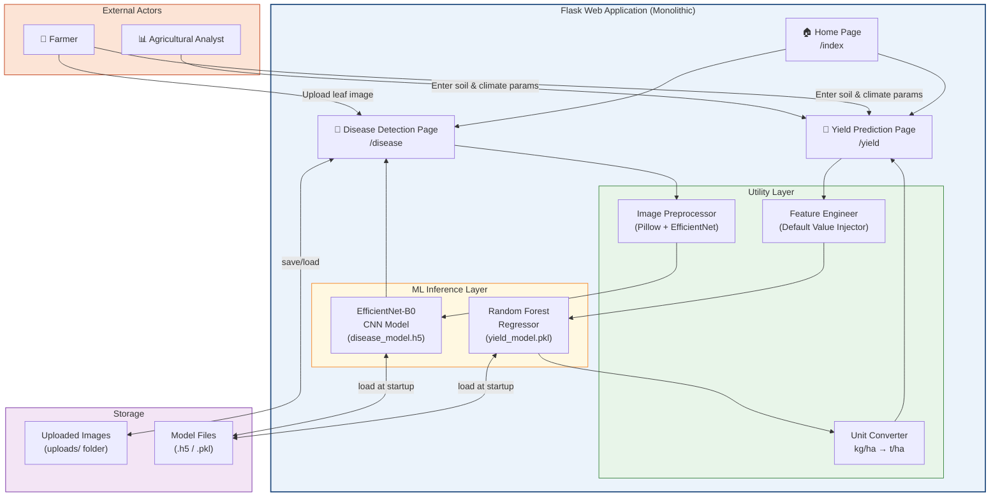

**Explanation:** The system exposes three pages through Flask. The Home Page provides navigation. The Disease Detection Page accepts an image upload, passes it through the preprocessing and CNN pipeline, and returns a disease class. The Yield Prediction Page collects user inputs, augments them with default values, passes them to the Random Forest model, converts the output, and returns the prediction. Both ML models are loaded from disk once at startup and held in memory.

---

## 4. Module Architecture

### 4.1 Module 1 — Disease Detection

#### 4.1.1 Design Description

The disease detection module accepts a single uploaded image of a paddy leaf and classifies it into one of four categories. It uses EfficientNet-B0 with ImageNet pre-trained weights fine-tuned on a domain-specific paddy leaf dataset.

| Attribute | Value |
|-----------|-------|
| Model architecture | EfficientNet-B0 |
| Pre-training | ImageNet (Transfer Learning) |
| Input resolution | 224 × 224 × 3 (RGB) |
| Output classes | 4 (Healthy, Brown Spot, Leaf Blast, Hispa) |
| Dataset size | 3,355 images |
| Train / Val split | 2,684 / 671 (80/20) |
| Training epochs | 15 |
| Top layer | GlobalAveragePooling2D → Dense(128, ReLU) → Dense(4, Softmax) |
| Preprocessing | `tf.keras.applications.efficientnet.preprocess_input` |

#### 4.1.2 Component Diagram

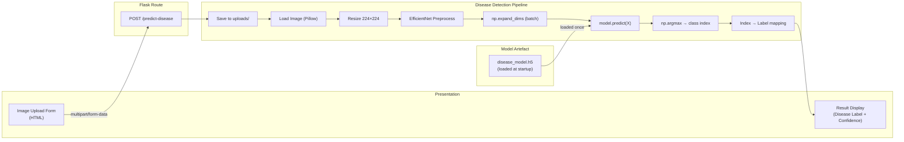

**Class labels index mapping:**
```
0 → Healthy
1 → Brown Spot
2 → Leaf Blast
3 → Hispa
```

### 4.2 Module 2 — Crop Yield Prediction

#### 4.2.1 Design Description

The yield prediction module accepts 8 user-specified agricultural parameters, augments them with 8 engineered/default features to construct a 16-feature vector, and passes it to a pre-trained Random Forest Regressor.

| Attribute | Value |
|-----------|-------|
| Model | Random Forest Regressor |
| Library | Scikit-learn (loaded via Joblib) |
| Training data | 995 samples, 20 Indian states, 1968–2017 |
| Features at training | 16 (including lag and environmental features) |
| User-supplied inputs | 8 |
| Auto-filled features | 8 (defaults + lag estimates) |
| Performance — R² | 0.9438 |
| Performance — RMSE | 174.97 kg/ha |
| Performance — MAE | 128.38 kg/ha |
| Performance — MAPE | 5.35% |
| Output | Yield in kg/ha → converted to tonnes/ha |

#### 4.2.2 Feature Mapping Table

| Feature | Source | Example Value |
|---------|--------|---------------|
| State | User input | Punjab |
| N_req_kg_per_ha | User input (N) | 90 |
| P_req_kg_per_ha | User input (P) | 42 |
| K_req_kg_per_ha | User input (K) | 43 |
| Temperature_C | User input | 25 |
| Humidity_% | User input | 80 |
| Rainfall_mm | User input | 200 |
| pH | User input | 6.5 |
| Year | Auto-filled default | 2017 |
| Wind_Speed_m_s | Auto-filled default | 3.5 |
| Solar_Radiation_MJ_m2_day | Auto-filled default | 18.0 |
| Yield_t1 | Estimated (prior yield proxy) | computed |
| Yield_t2 | Estimated (prior yield proxy) | computed |
| Rainfall_t1 | Derived from Rainfall_mm | rainfall × 0.95 |
| Rainfall_t2 | Derived from Rainfall_mm | rainfall × 0.90 |
| Temp_t1 | Derived from Temperature_C | temperature − 0.3 |

---

## 5. Data Architecture

### 5.1 Data Flow Overview

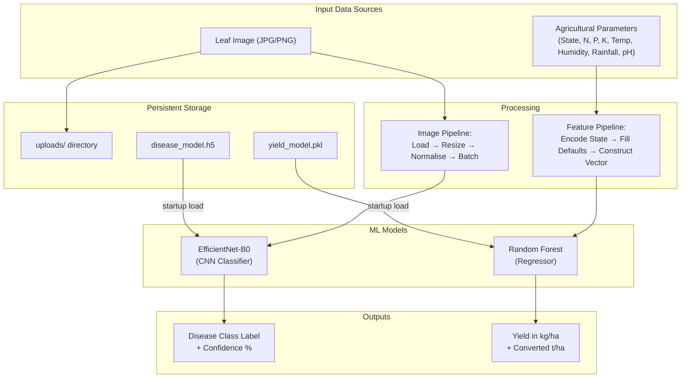

### 5.2 Disease Detection Dataset

| Attribute | Value |
|-----------|-------|
| Source | Kaggle — Paddy Leaf Disease Dataset |
| Total images | 3,355 |
| Training images | 2,684 (80%) |
| Validation images | 671 (20%) |
| Classes | Healthy (0), Brown Spot (1), Leaf Blast (2), Hispa (3) |
| Image format | JPEG/PNG |
| Input resolution | 224 × 224 pixels |

### 5.3 Crop Yield Dataset

| Attribute | Value |
|-----------|-------|
| Source | Custom India state-level agricultural dataset |
| Coverage | 20 Indian states |
| Time range | 1968 – 2017 |
| Raw rows | ~14,978 district-level records |
| Aggregated samples | 995 (state-year level) |
| Features | 16 (including 6 lag-engineered features) |
| Target | Yield_kg_per_ha |

---

## 6. Machine Learning Pipeline Architecture

### 6.1 Disease Detection Pipeline

```mermaid
flowchart LR
    A["Raw Dataset\n3355 images\n4 classes"] --> B["Train/Val Split\n80:20"]
    B --> C["Data Augmentation\n(rotation, flip, zoom)"]
    C --> D["EfficientNet-B0\nBase (frozen weights)"]
    D --> E["GlobalAvgPool2D"]
    E --> F["Dense 128, ReLU\n+ Dropout(0.3)"]
    F --> G["Dense 4, Softmax\n(Output Layer)"]
    G --> H["Training\n15 Epochs\nAdam Optimiser\nCategorical CrossEntropy"]
    H --> I["Validation\nAccuracy & Loss"]
    I --> J["Saved Model\ndisease_model.h5"]
    J --> K["Flask Inference\n1 image → 1 prediction"]

    style A fill:#EBF3FB
    style J fill:#E8F5E9
    style K fill:#FFF8E1
```

### 6.2 Crop Yield ML Pipeline

```mermaid
flowchart LR
    A2["Raw Agricultural Data\n14978 district rows"] --> B2["Filter: Rice/Paddy\nIndia only"]
    B2 --> C2["State-Year Aggregation\nArea-weighted yield"]
    C2 --> D2["Lag Feature Engineering\nYield_t1, t2\nRainfall_t1, t2\nTemp_t1"]
    D2 --> E2["995 clean samples\n20 states\n16 features"]
    E2 --> F2["Time-Based Split\nTrain: 1968–2012\nTest: 2013–2017"]
    F2 --> G2["Preprocessing\nLabelEncoder (State)\nStandardScaler (numerics)"]
    G2 --> H2["Random Forest\nRegressor Training"]
    H2 --> I2["Evaluation\nR²=0.9438\nRMSE=174.97\nMAPE=5.35%"]
    I2 --> J2["Serialise\nyield_model.pkl\npreprocessor.pkl"]
    J2 --> K2["Flask Inference\n16 features → yield kg/ha"]

    style A2 fill:#FFF8E1
    style J2 fill:#E8F5E9
    style K2 fill:#FCE4D6
```

---

## 7. Application Architecture

### 7.1 Sequence Diagram — Disease Prediction Flow

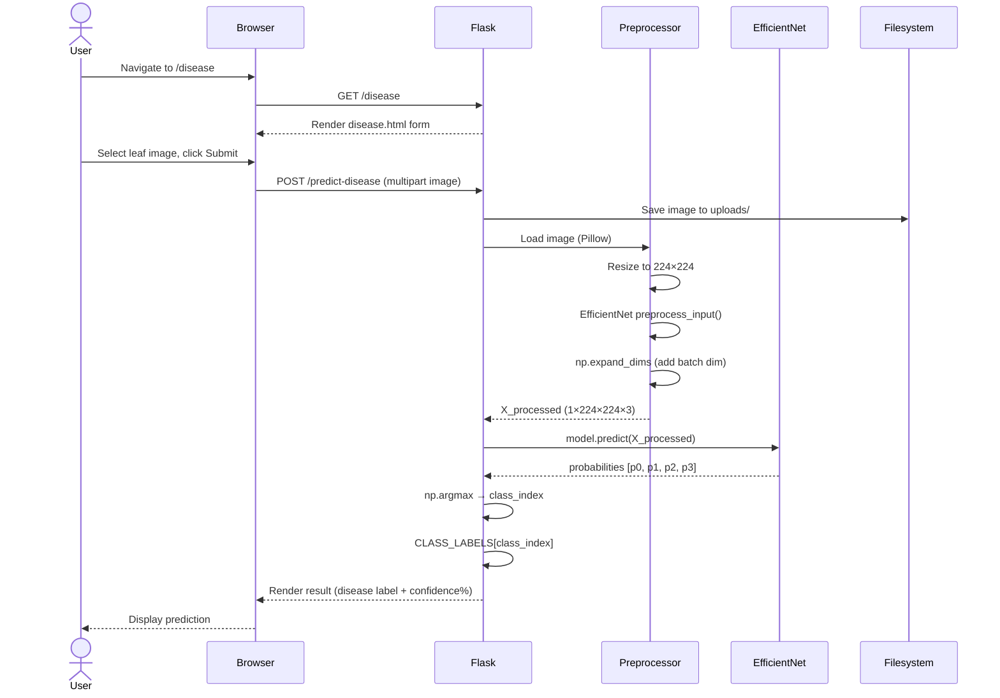

### 7.2 Sequence Diagram — Crop Yield Prediction Flow

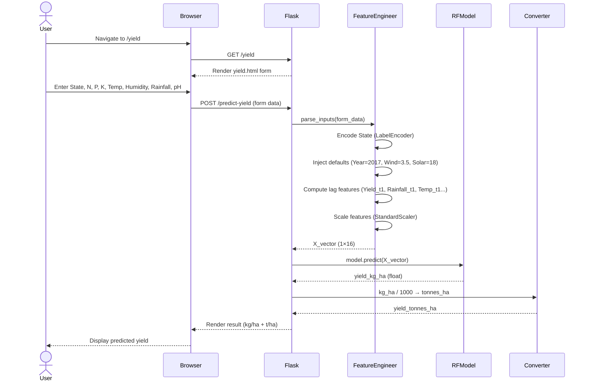

### 7.3 Class Diagram — Backend

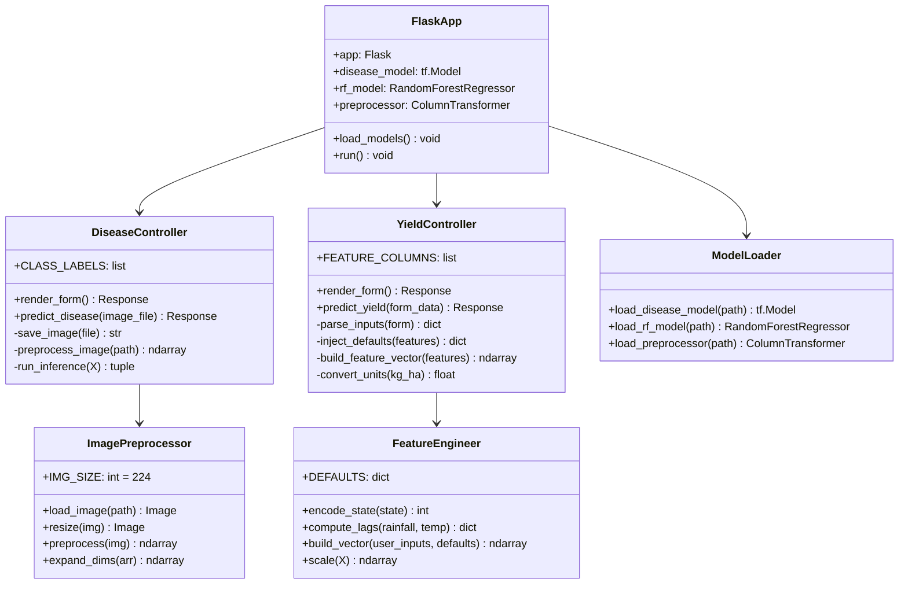

---

## 8. Deployment Architecture

### 8.1 Deployment Diagram

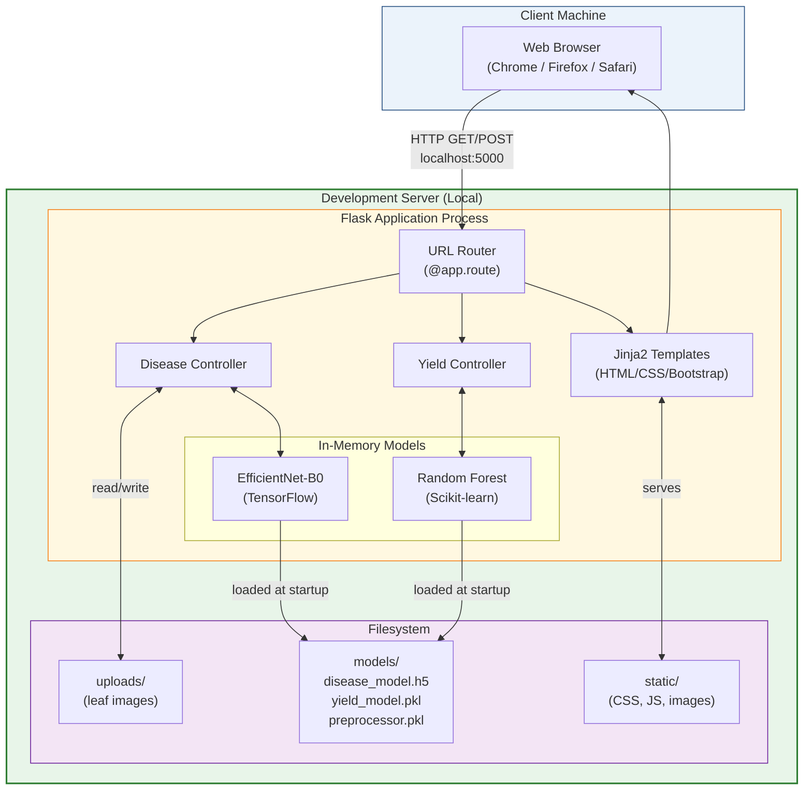

### 8.2 Runtime Configuration

| Parameter | Value |
|-----------|-------|
| Runtime | Python 3.10+ |
| Web server | Flask Development Server (Werkzeug) |
| Host | localhost (127.0.0.1) |
| Port | 5000 |
| Debug mode | True (development) |
| Model loading | At application startup (`before_first_request` or module-level) |
| Uploaded file storage | `uploads/` directory (local) |
| Max upload size | 16 MB (Flask `MAX_CONTENT_LENGTH`) |

---

## 9. Database Design

### 9.1 Design Note

The current implementation uses the **filesystem and in-memory state** for temporary storage (uploaded images, model objects). A relational database layer is architecturally defined below for production readiness and is recommended for future sprints.

### 9.2 ER Diagram

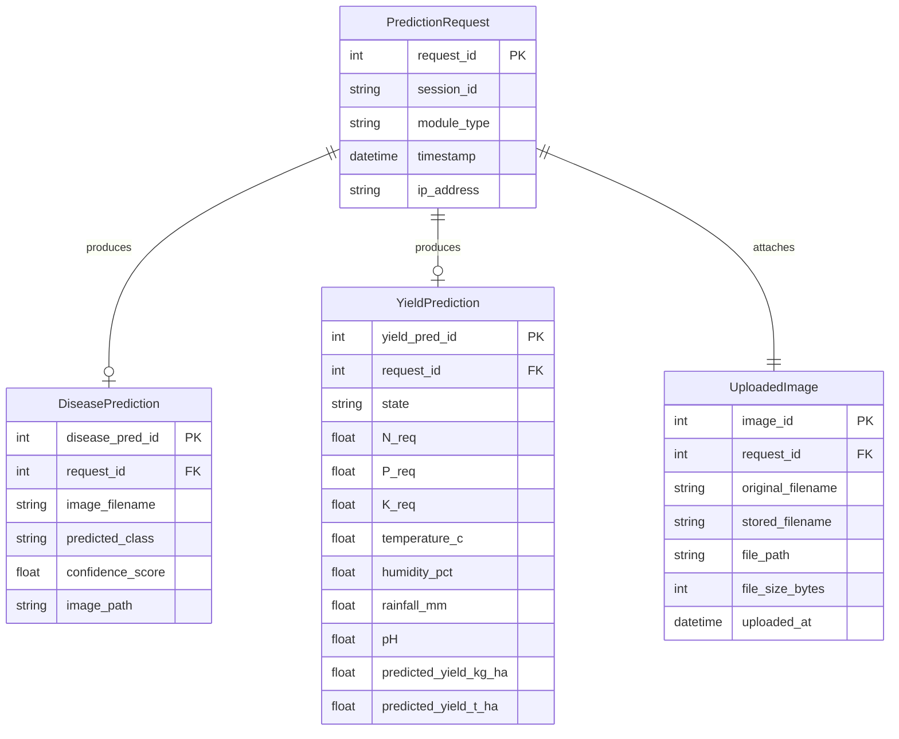

### 9.3 Schema Definitions

#### Table: prediction_requests

| Column | Type | Constraint |
|--------|------|-----------|
| request_id | INTEGER | PRIMARY KEY AUTOINCREMENT |
| session_id | VARCHAR(64) | NOT NULL |
| module_type | VARCHAR(20) | NOT NULL — 'disease' or 'yield' |
| timestamp | TIMESTAMP | DEFAULT CURRENT_TIMESTAMP |
| ip_address | VARCHAR(45) | |

#### Table: disease_predictions

| Column | Type | Constraint |
|--------|------|-----------|
| disease_pred_id | INTEGER | PRIMARY KEY AUTOINCREMENT |
| request_id | INTEGER | FOREIGN KEY → prediction_requests |
| image_filename | VARCHAR(255) | NOT NULL |
| predicted_class | VARCHAR(50) | NOT NULL — Healthy / Brown Spot / Leaf Blast / Hispa |
| confidence_score | FLOAT | NOT NULL — value in [0.0, 1.0] |
| image_path | VARCHAR(512) | |

#### Table: yield_predictions

| Column | Type | Constraint |
|--------|------|-----------|
| yield_pred_id | INTEGER | PRIMARY KEY AUTOINCREMENT |
| request_id | INTEGER | FOREIGN KEY → prediction_requests |
| state | VARCHAR(60) | NOT NULL |
| N_req | FLOAT | |
| P_req | FLOAT | |
| K_req | FLOAT | |
| temperature_c | FLOAT | |
| humidity_pct | FLOAT | |
| rainfall_mm | FLOAT | |
| pH | FLOAT | |
| predicted_yield_kg_ha | FLOAT | NOT NULL |
| predicted_yield_t_ha | FLOAT | NOT NULL |

#### Table: uploaded_images

| Column | Type | Constraint |
|--------|------|-----------|
| image_id | INTEGER | PRIMARY KEY AUTOINCREMENT |
| request_id | INTEGER | FOREIGN KEY → prediction_requests |
| original_filename | VARCHAR(255) | |
| stored_filename | VARCHAR(255) | UNIQUE |
| file_path | VARCHAR(512) | |
| file_size_bytes | INTEGER | |
| uploaded_at | TIMESTAMP | DEFAULT CURRENT_TIMESTAMP |

---

## 10. API Design

### 10.1 API Interaction Diagram

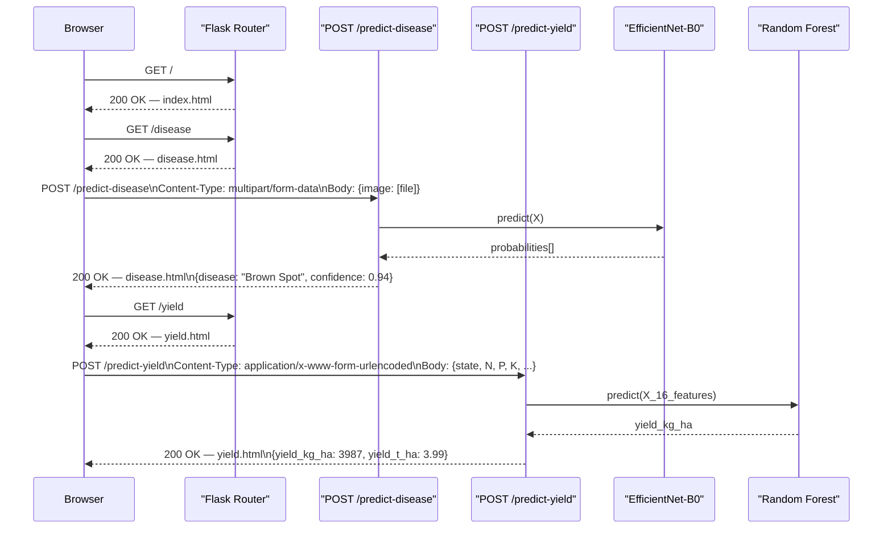

### 10.2 API Endpoint Specification

---

#### `POST /predict-disease`

**Purpose:** Accept a paddy leaf image and return the predicted disease class.

**Request:**
```
Method:       POST
Content-Type: multipart/form-data
Body:
  image       : file   (JPEG or PNG, max 16MB)
```

**Response (success — HTTP 200):**
```json
{
  "disease": "Brown Spot",
  "confidence": 0.9412,
  "all_probabilities": {
    "Healthy": 0.0231,
    "Brown Spot": 0.9412,
    "Leaf Blast": 0.0247,
    "Hispa": 0.0110
  }
}
```

**Response (error — HTTP 400):**
```json
{
  "error": "No image file provided or unsupported file format."
}
```

---

#### `POST /predict-yield`

**Purpose:** Accept agricultural parameters and return predicted paddy crop yield.

**Request:**
```
Method:       POST
Content-Type: application/x-www-form-urlencoded
Body:
  state       : string   (e.g., "Punjab")
  N           : float    (Nitrogen requirement, kg/ha)
  P           : float    (Phosphorus requirement, kg/ha)
  K           : float    (Potassium requirement, kg/ha)
  temperature : float    (Temperature in °C)
  humidity    : float    (Relative humidity %)
  rainfall    : float    (Annual rainfall in mm)
  pH          : float    (Soil pH value)
```

**Example Request Body:**
```
state=Punjab&N=90&P=42&K=43&temperature=25&humidity=80&rainfall=200&pH=6.5
```

**Response (success — HTTP 200):**
```json
{
  "state": "Punjab",
  "predicted_yield_kg_ha": 3987.43,
  "predicted_yield_t_ha": 3.99,
  "inputs_received": {
    "N": 90, "P": 42, "K": 43,
    "temperature": 25, "humidity": 80,
    "rainfall": 200, "pH": 6.5
  },
  "auto_filled_features": {
    "year": 2017,
    "wind_speed": 3.5,
    "solar_radiation": 18.0
  }
}
```

**Response (error — HTTP 400):**
```json
{
  "error": "Missing required field: state"
}
```

---

#### `GET /`

Returns the home page with navigation to both modules. No body parameters required.

#### `GET /disease`

Returns the disease prediction input form page.

#### `GET /yield`

Returns the yield prediction input form page.

---

## 11. Security Considerations

| Consideration | Risk | Mitigation |
|--------------|------|-----------|
| **File upload security** | Malicious file disguised as image (e.g., .php uploaded as .jpg) | Validate MIME type using Pillow; restrict extensions to .jpg, .jpeg, .png; use `secure_filename()` (Werkzeug) |
| **File size limit** | Denial-of-service via oversized upload | Set `MAX_CONTENT_LENGTH = 16 * 1024 * 1024` in Flask config |
| **Path traversal** | User-supplied filenames containing `../` | All uploads use `uuid4()` generated filenames; never use raw user-supplied names |
| **Input validation** | Malformed numeric inputs causing inference errors | Validate all form fields for type and range before model inference; return HTTP 400 on failure |
| **Model file integrity** | Tampered `.pkl` or `.h5` files | Model files should be version-controlled and checksummed; do not accept model files from user uploads |
| **Debug mode in production** | Flask debug mode exposes interactive debugger | Disable `debug=True` before any production deployment; use environment variable `FLASK_ENV=production` |
| **CSRF** | Cross-Site Request Forgery on form submissions | Implement Flask-WTF CSRF tokens on all POST forms |

---

## 12. Scalability Considerations

The current architecture is optimised for single-user, local academic deployment. The following considerations apply for scaling:

| Scale Dimension | Current State | Recommended Upgrade |
|-----------------|--------------|---------------------|
| **Concurrent users** | Single-threaded Flask dev server | Switch to Gunicorn (multi-worker WSGI) + Nginx reverse proxy |
| **Model loading** | Models loaded once per process | Multiple Gunicorn workers = multiple model loads; use shared memory or model server (TensorFlow Serving) |
| **Image storage** | Local `uploads/` directory | AWS S3 / Google Cloud Storage for distributed file access |
| **Database** | Filesystem / no DB | PostgreSQL with SQLAlchemy ORM |
| **Model serving** | In-process inference | Dedicated inference microservice (TF Serving / Triton) |
| **Containerisation** | None | Docker + docker-compose for portable, reproducible deployment |
| **CI/CD** | Manual | GitHub Actions pipeline for automated testing and deployment |

---

## 13. Future Architecture Improvements

### 13.1 Short-Term (Next Sprint)

1. **Add SQLite/PostgreSQL database** to persist prediction history and enable analytics dashboards.
2. **Implement user session tracking** to associate predictions with anonymous sessions.
3. **Add confidence threshold alerting** — flag predictions with low confidence (<50%) with a warning banner.
4. **Mobile-responsive UI** — refactor Bootstrap templates for smartphone-friendly usage by field farmers.

### 13.2 Medium-Term

1. **REST API decoupling** — expose `/predict-disease` and `/predict-yield` as proper JSON REST APIs (returning JSON not rendered HTML), enabling integration with mobile apps or third-party agricultural platforms.
2. **Model retraining pipeline** — automate retraining when new labelled images are submitted, using an MLflow tracking server.
3. **Additional disease classes** — extend the CNN to detect Sheath Blight, Bacterial Leaf Blight, and other paddy diseases from expanded datasets.
4. **Additional crop support** — extend the yield model to support wheat, maize, and soybean by retraining with multi-crop datasets.

### 13.3 Long-Term

1. **Microservices migration** — extract Disease Detection and Yield Prediction into independent containerised microservices communicating via REST or gRPC.
2. **Edge deployment** — compress and quantise the EfficientNet-B0 model using TensorFlow Lite for offline inference on low-power Android smartphones used in rural India.
3. **Satellite data integration** — incorporate NDVI (Normalized Difference Vegetation Index) from satellite imagery as an automated input feature for yield prediction.
4. **Federated learning** — enable distributed model training across farmer cooperatives without centralising raw field data, preserving privacy.

---

## References

1. Tan, M., & Le, Q. V. (2019). *EfficientNet: Rethinking Model Scaling for Convolutional Neural Networks*. International Conference on Machine Learning (ICML).
2. Breiman, L. (2001). *Random Forests*. Machine Learning, 45(1), 5–32.
3. Flask Documentation. (2024). *Flask — A lightweight WSGI web application framework*. https://flask.palletsprojects.com/
4. TensorFlow Documentation. (2024). *TensorFlow 2.x — Keras Transfer Learning Guide*. https://www.tensorflow.org/
5. Scikit-learn Documentation. (2024). *sklearn.ensemble.RandomForestRegressor*. https://scikit-learn.org/
6. IEEE Standard 1016-2009. *IEEE Standard for Information Technology — Systems Design — Software Design Descriptions.*

---

*End of System Architecture Document — Version 1.0 | March 2026*
